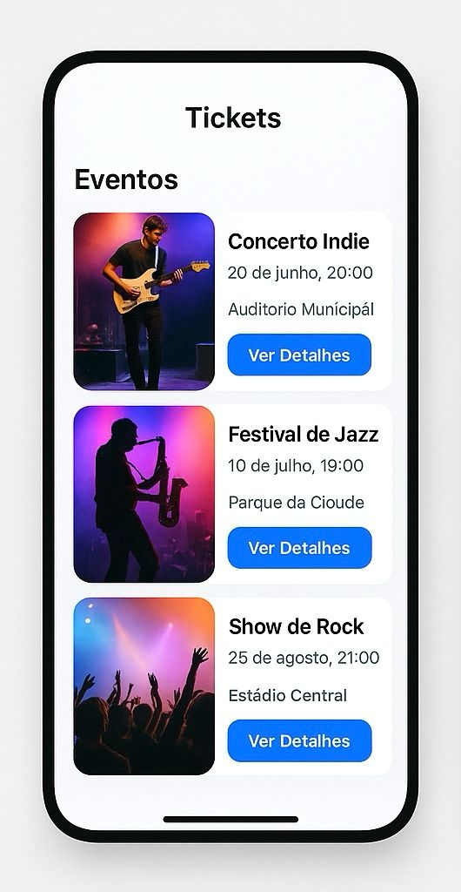

# Tickets 🎟

Aplicativo móvel simples para visualização de tickets de eventos.

## 📱 Telas do Aplicativo

### 1. Lista de eventos


### 2. Detalhe de um evento



## ⚙ Requisitos para rodar o projeto

- Node.js instalado
- Expo CLI instalado (npm install -g expo-cli)
- Emulador Android/iOS ou aplicativo Expo Go no celular

## ▶ Como rodar

```bash
git clone https://github.com/seuusuario/tickets
cd tickets
npm install
expo start